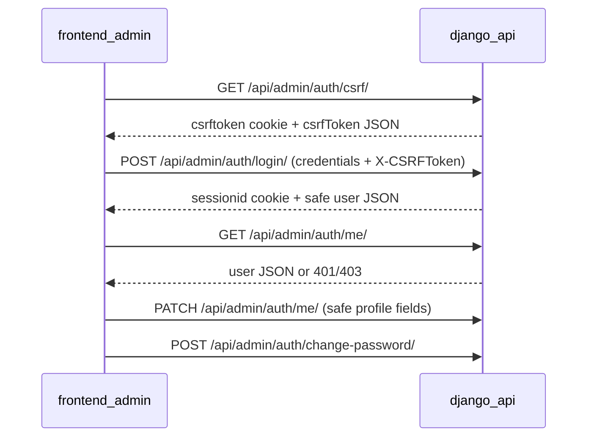
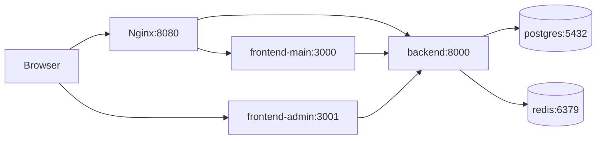

# Architecture

Razzak Machinaries is a **multi-container** system orchestrated by Docker Compose, with a **pnpm monorepo** for TypeScript frontends and a standalone Django backend.

## Components

### Backend (`apps/backend`)

- **Framework**: Django + Django REST Framework
- **Public API** (custom): `GET /api/health/`, `GET /api/hello/`, `GET /api/public/meta/`
- **API errors**: JSON envelope with `success: false` and `error.code`, `error.message`, `error.details` (safe messages only; no stack traces)
- **Admin API** (session auth): `GET /api/admin/auth/csrf/`, `POST /api/admin/auth/login/`, `POST /api/admin/auth/logout/`, `GET /api/admin/auth/me/` — active **superusers** only
- **Django admin UI**: built-in HTML admin at `/admin/` (separate from the Next admin app)
- **Data**: PostgreSQL via `DATABASES`
- **Cache**: Redis via `django-redis` (`CACHES`)
- **Settings split**: `config.settings.{dev,test,prod}` selected by `DJANGO_SETTINGS_MODULE`

### Frontends

- **`apps/frontend-main`**: primary user-facing Next.js app.
- **`apps/frontend-admin`**: Next.js admin app with session login (`/login`) and protected profile (`/`).

Both apps:

- Call the backend using shared helpers from `@razzak-machinaries/shared`
- Are built as **Next.js standalone** outputs in production images

### Shared package (`packages/shared`)

Workspace package `@razzak-machinaries/shared` provides:

- **API client layer** — Axios-based, type-safe HTTP in `packages/shared/src/api/` (never import Axios in frontend apps)
- Preconfigured clients: `backendMainApi` (stateless public API), `backendAdminApi` (session + CSRF for admin auth)
- Thin endpoint helpers (`getHello`, `adminAuthApi`)
- **Shared UI** (`packages/shared/src/ui/`) — **AgriSteel Marketplace** theme (field-green primary, warm agricultural neutrals, Noto Sans + Inter + JetBrains Mono, light/dark). Tailwind v4, shadcn primitives, Basecoat CSS. Import via `@razzak-machinaries/shared/ui`. See [`ui-system.md`](ui-system.md).
- **Internationalization** (`packages/shared/src/i18n/`) — bilingual types, localization utilities, static translation dictionaries, `LanguageProvider`, `BilingualText`, and `LanguageSwitcher`. Client-side preference via `localStorage`. See [`bilingual-system.md`](bilingual-system.md).
- Hooks (`useApi`)
- Types and route constants
- CSP / security headers for Next.js

Exports are declared in `packages/shared/package.json` so imports are stable across local dev, Docker, and CI.

#### Shared UI

```text
packages/shared/src/ui/
  components/           # Public design-system components
  primitives/shadcn/    # shadcn/ui primitives (CLI-maintained)
  theme/                # ThemeProvider, tokens
  styles/globals.css    # Tailwind + Basecoat + CSS variables
```

Both frontends import `@razzak-machinaries/shared/ui/styles/globals.css` in root layout and wrap content with `ThemeProvider`.

#### Shared API client

```text
packages/shared/src/api/
  index.ts              # public barrel (@razzak-machinaries/shared/api)
  clients/
    backend-main.ts     # backendMainApi (withCredentials: false)
    backend-admin.ts    # backendAdminApi (withCredentials: true, CSRF tokenProvider)
  core/
    create-api-client.ts
    errors.ts, csrf.ts, env.ts, interceptors.ts, ...
  hello.ts              # public endpoint wrappers
  admin-auth.ts         # adminAuthApi (login, logout, getCurrentUser, ensureAdminCsrf)
```

- **Single Axios dependency** lives in `@razzak-machinaries/shared`; both frontends consume clients from here.
- **Multiple backends**: add `api/clients/backend-secondary.ts` with `createApiClient({ serviceName, baseURL: env.backendSecondaryApiUrl, ... })` and export from `api/index.ts`.
- **Errors**: Axios failures are normalized to `ApiError` with safe `message` and flags (`isUnauthorized`, `isNetworkError`, etc.). Backend envelopes use sanitized messages, but **frontend UI must render errors via `getUserFacingMessage(error, language)`** (or the approved localized path)—never raw `error.message` or `AxiosError`.
- **CSRF / cookies**: `backendMainApi` stays stateless (`withCredentials: false`). `backendAdminApi` uses `withCredentials: true` and a CSRF bootstrap (`GET /api/admin/auth/csrf/`) because production sets `CSRF_COOKIE_HTTPONLY=True`.
- **Env**: `NEXT_PUBLIC_BACKEND_MAIN_API_URL` (see [`environment-variables.md`](environment-variables.md)).

### Admin authentication flow



**Authorization policy:** authenticated, `is_active=True`, `is_superuser=True`. Staff-only users are rejected. Backend enforces this on login and `me`; the Next app adds route guards (`RequireAdminAuth`, `RedirectIfAuthenticated`) for UX only.

**Operational account management (server-only, not exposed via public API):**

- `sync_superusers_from_env` — idempotent superuser bootstrap from `ADMIN_SUPERUSERS` (`make backend-sync-superusers`, `make prod-sync-superusers`, `make test-sync-superusers`).
- `issue_temporary_password` — interactive one-time password for an existing user (`make backend-reset-user-password`, `make prod-reset-user-password`).

### PostgreSQL

Primary relational store for Django (sessions, admin, future models).

### Redis

Used as Django’s default cache backend (`django-redis`).

### Nginx

- **Dev/Debug**: HTTP reverse proxy on `:8080` routing `/`, `/api/`, `/static/`, and `/admin/` (Django admin). Next admin shell on `:3001/`.
- **Prod**: HTTPS-only routing by hostname (`razzak-machinaries.com`, `admin.razzak-machinaries.com`, `api.razzak-machinaries.com` in the sample config).

### Docker Compose environments

Compose stacks live under **`infra/docker/compose/`** (not the repo root). Scripts and the Makefile invoke:

`docker compose --project-directory <repo-root> -f infra/docker/compose/docker-compose.<stack>.yml …`

so paths inside YAML (`context: .`, `./apps/...`, `./infra/...`) stay root-relative.

| Compose file                                                                                        | Purpose                                                                           |
| --------------------------------------------------------------------------------------------------- | --------------------------------------------------------------------------------- |
| [`infra/docker/compose/docker-compose.dev.yml`](../infra/docker/compose/docker-compose.dev.yml)     | Hot reload + bind mounts                                                          |
| [`infra/docker/compose/docker-compose.debug.yml`](../infra/docker/compose/docker-compose.debug.yml) | Same as dev, but Django runs under **debugpy** (`5678`)                           |
| [`infra/docker/compose/docker-compose.test.yml`](../infra/docker/compose/docker-compose.test.yml)   | Postgres + Redis + **one-shot `test-runner`** image executing the full test suite |
| [`infra/docker/compose/docker-compose.prod.yml`](../infra/docker/compose/docker-compose.prod.yml)   | Non-dev services: Gunicorn + built Next apps + TLS-ready Nginx                    |

## Request flow (development)



## Intentional non-goals (for this skeleton)

- No JWT/OAuth/SSO for the main user app
- No staff RBAC beyond superuser gate for the Next admin app
- No advanced observability platform wiring

Extend these in application code when requirements appear.
